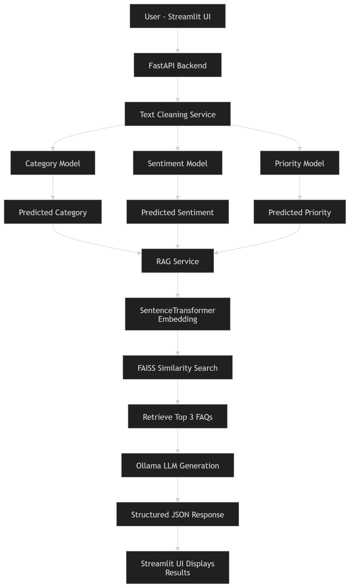
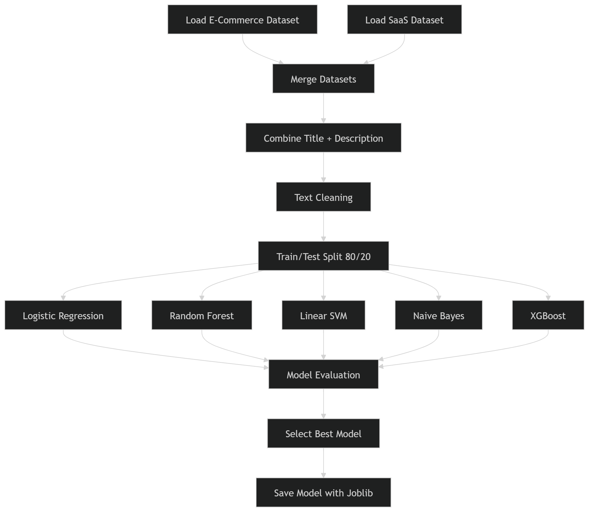
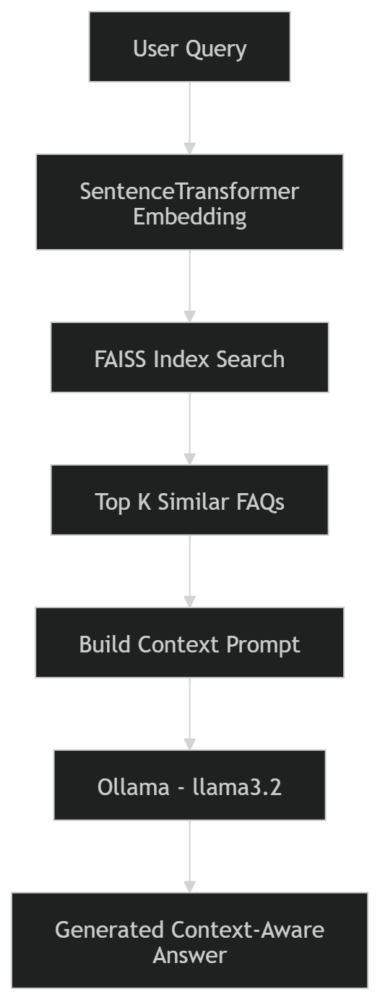

# AI Powered Customer Support System

An intelligent customer support system that uses **Machine Learning and NLP** to automatically analyze support tickets, classify them, detect sentiment, determine priority, and generate helpful responses using a **Retrieval-Augmented Generation (RAG)** approach.

The system helps companies automate customer service by quickly understanding customer issues and providing relevant solutions.

---

# Project Overview

Customer support teams receive thousands of tickets daily. Manually analyzing these tickets is time-consuming and inefficient.

This project builds an **AI-powered solution** that can:

- Classify customer tickets into categories
- Detect the sentiment of the customer message
- Predict the urgency/priority of the issue
- Retrieve relevant answers from a knowledge base (FAQ)
- Generate intelligent responses

The system combines **Machine Learning models** with **RAG (Retrieval-Augmented Generation)** to create a smarter customer support assistant.

---

## AI System Interface


**Figure 1:** AI Interface used to submit customer tickets and display predictions including category, sentiment, priority, and generated response.

---

# Features

- Automatic **ticket categorization**
- **Sentiment analysis** of customer messages
- **Priority prediction** for support tickets
- **FAQ retrieval system**
- **RAG-based response generation**
- Interactive **Streamlit Web Application**

---

## System High Level Architecture



**Figure 2:** High-level architecture showing how the Streamlit interface interacts with the backend services, ML models, and the RAG system.

---

# Categories

The system classifies tickets into the following categories:

- **Account Issues**
- **Technical Issues**
- **Billing Issues**
- **Delivery Issues**

---

# Project Structure
```bash
FinalProject
│
├── code
│ ├── category_final_version.ipynb
│ ├── sentiment_final_version.ipynb
│ ├── priority_final_version.ipynb
│
├── dataset
│ ├── E-Commerce_data.csv
│ ├── SaaS_Tech_data.csv
│ ├── faq_ecommerce.csv
│ ├── faq_saas.csv
│ ├── faq.csv
│ ├── merge_faq.ipynb
│
├── models
│ ├── category_pipeline_lr.pkl
│ ├── sentiment_pipeline_lsvm.pkl
│ ├── priority_pipeline_lsvm.pkl
│ ├── faiss_index.pkl
│ ├── faq_data.pkl
│ ├── faq_embeddings.pkl
│
├── docs
│ ├──AI Powered Customer Support System.pdf
│ ├──AI I.png
│ ├──HL.png
│ ├──RAG.png
│ ├──TWF.png
│ ├──Recuirements.pdf
│
├── services
│ ├── ml_service.py
│ ├── nlp_service.py
│ ├── text_cleaner.py
│
├── app.py
│ 
├── streamlit_app.py
│ 
├── rag_service.py
│ 
├── requirements.txt
│
├── LICENSE
│
└── README.md
```

---

# Technologies Used

- Python
- Scikit-learn
- XGBoost
- NLTK
- Pandas
- Streamlit
- TF-IDF Vectorization
- Machine Learning Pipelines
- Retrieval-Augmented Generation (RAG)

---

# Machine Learning Models

Multiple models were trained and compared:

- Logistic Regression
- Random Forest
- Linear SVM
- Multinomial Naive Bayes
- XGBoost

### Best Models Selected

| Task                    | Best Model          |
| ----------------------- | ------------------- |
| Category Classification | Logistic Regression |
| Sentiment Analysis      | Linear SVM          |
| Priority Prediction     | Linear SVM          |

---

# Dataset

The dataset combines customer support tickets from two domains:

- **E-commerce support tickets**
- **SaaS / Tech support tickets**

Each ticket includes:

- Title
- Description
- Category
- Sentiment
- Priority

Total dataset size: **~20,000 tickets**

---

# Text Preprocessing

The following preprocessing steps were applied:

- Lowercasing
- Removing punctuation
- Removing numbers
- Removing stopwords
- Cleaning non-alphabetic characters
- TF-IDF vectorization

---

## Model Training Workflow



**Figure 4:** Training workflow showing dataset preparation, preprocessing, model training, evaluation, and model selection.

---

# Model Performance

### Category Classification

Accuracy: **97%**

### Sentiment Analysis

Accuracy: **64%**

### Priority Prediction

Accuracy: **60%**

---

# Retrieval-Augmented Generation (RAG)

The system uses a **FAQ knowledge base** to retrieve the most relevant answer for a user query.

### RAG Architecture



**Figure 3:** Retrieval-Augmented Generation pipeline used to retrieve relevant FAQs using FAISS and generate a context-aware response with the LLM.

Steps:

1. User submits a support message
2. System predicts:
   - category
   - sentiment
   - priority
3. Query is matched against the FAQ dataset
4. The most relevant answer is retrieved
5. The response is generated for the user

---

# System Workflow

1. User submits a support ticket
2. Text preprocessing is applied
3. Ticket is classified using ML models
4. Sentiment and priority are predicted
5. FAQ retrieval finds relevant solutions
6. Final response is generated for the user

---

# How to Run the Project

### 1 Install Dependencies

```bash
pip install -r requirements.txt
```

### 2 Run the Application

```bash
streamlit run streamlit_app.py
```

### 3 Open in Browser

```bash
http://localhost:8501
```

### Example Input

```bash
Title: I can't log into my account
Description: I tried resetting my password but it still doesn't work.
```

### Example Output

```bash
Category: ACCOUNT
Sentiment: NEGATIVE
Priority: MEDIUM

Suggested Solution:
Sorry to hear that you're having trouble logging into your account after trying to reset your password.
Try waiting for 30 minutes and then attempting login again.
If you continue to experience issues, please contact our support team so we can assist you further.
```

---

# Future Improvements

1. Improve sentiment accuracy
2. Add multi-language support
3. Improve RAG retrieval quality
4. Deploy the system using Docker or Cloud

---

# Author

Eng. Mahmoud Mohamed El-Saeed

AI Discovery Camp Final Project

# License

This project is licensed under the MIT License.
